<h2>Compte rendu pour réaliser une application qui permet de gérer des comptes respectant les patterns CQRS et Event Sourcing avec les Framework AXON et Spring Boot :</h2>
<h3>Captures </h3>

<ul>

<li>Créer un compte avec Postman</li>
 
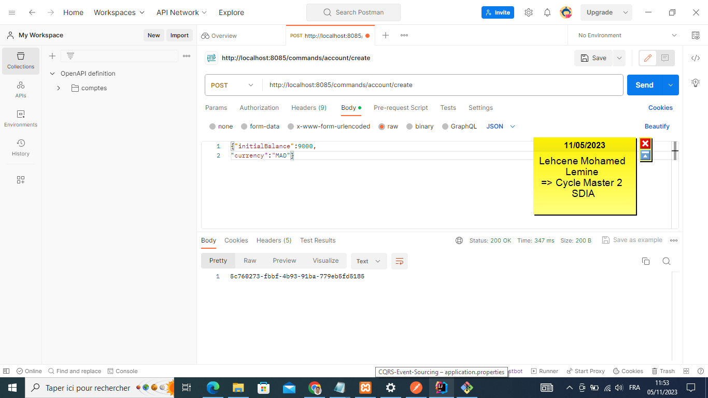

<li>Voici Base Données qui créer persistance par FrameWork Axone avec Tableau : domain_evnt_entry contient tous les évenement qui ont réaliser par l'applications.</li>
 
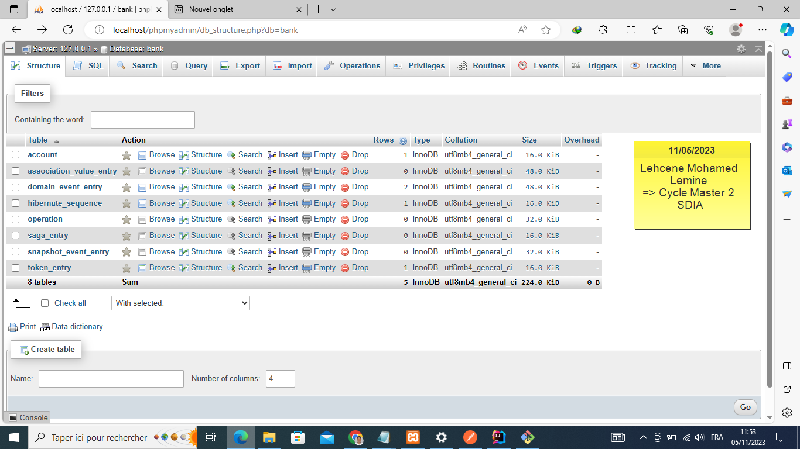

<li>Voici le contenu du tableau account qui contient listes des comptes qui sont réaliser depuis Postman</li>

<li>Voici les contenu du tableau domain_event_entry qui conient l'ensemble des évenement qui sont réaliser sur la compte l'un Created et la secomde Activated.</li>
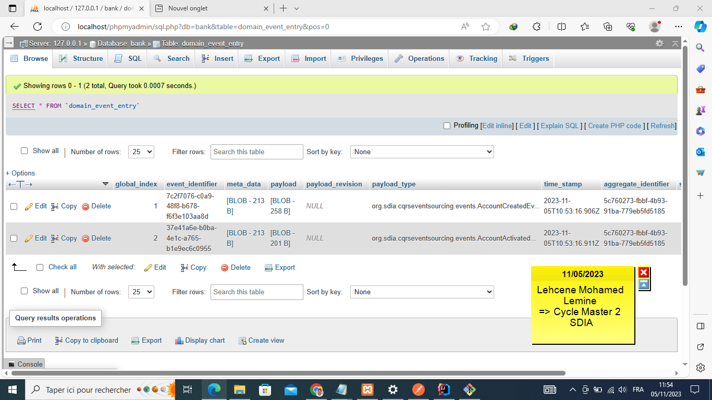

<li>Voici le contenu du payload qui contient des informations sur l'évenement AccountCreatedEvent.</li>
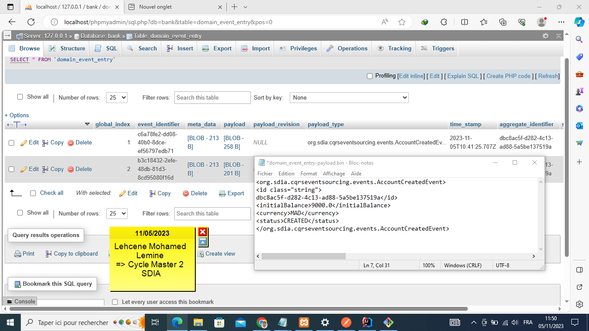

<li>Voici le contenu du payload qui contient des informations sur l'évenement AccountActivatedEvent.</li>
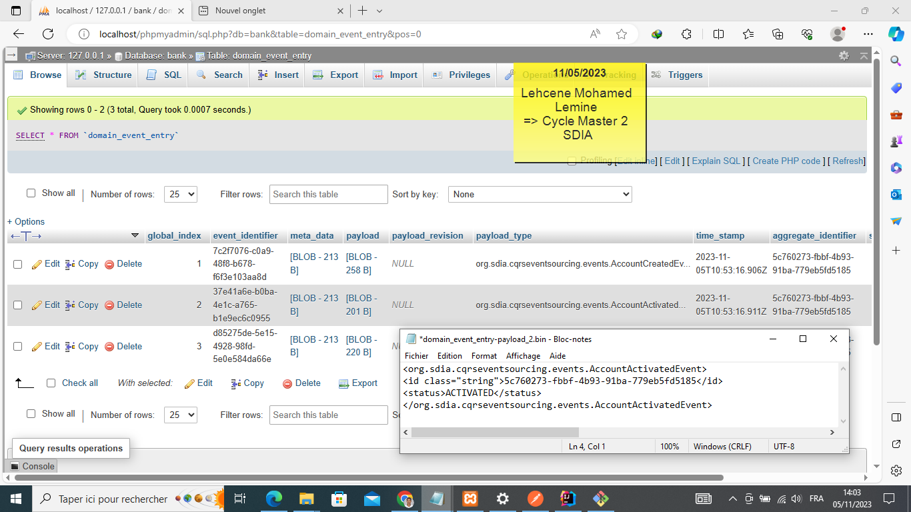

<li>Contenu du event Strore</li>
 
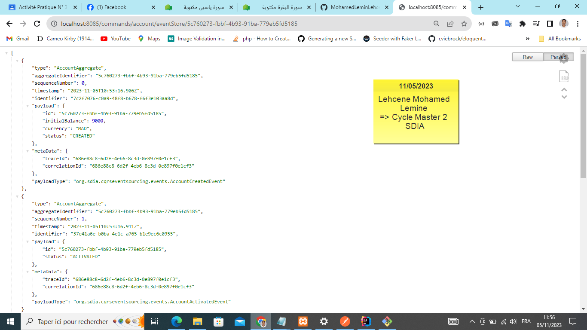

<li>Pour effectuer les operations du modifications sur base de données comme : update,delete</li>
 
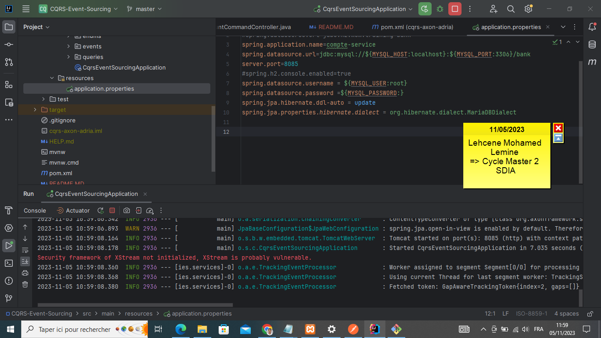

<li>Pour efectuer opérations crédit sur compte, mais la valeur du l'attribut amount doit ne doit pas étre un  valeur négative.</li>
 
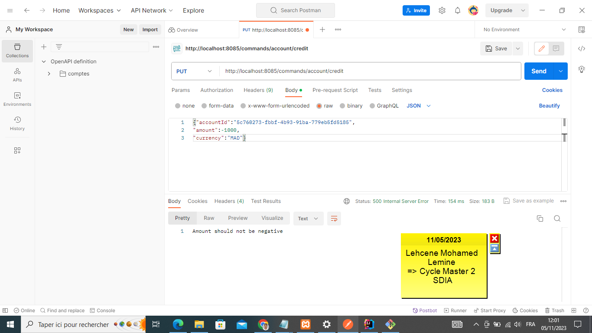

<li>Crédit un  compte est effectuent</li>
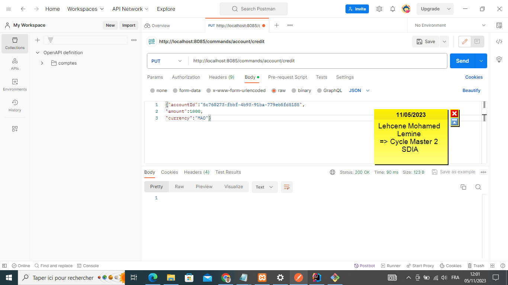

<li>La valeur de l'attribut amount avent Crédit égale 9000 MD.</li>
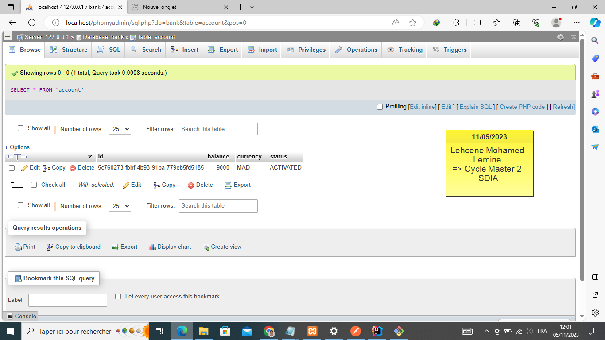
 

<li>Voci aprés Crédit du compte à partir du Postman la valeur du amount pour compte devient 1000 MD.</li>
 

<li>L'operation du type Crédit qu'on a effecute sur le compte par son ID.</li>

<li>Voici contenu de ventStore.</li>
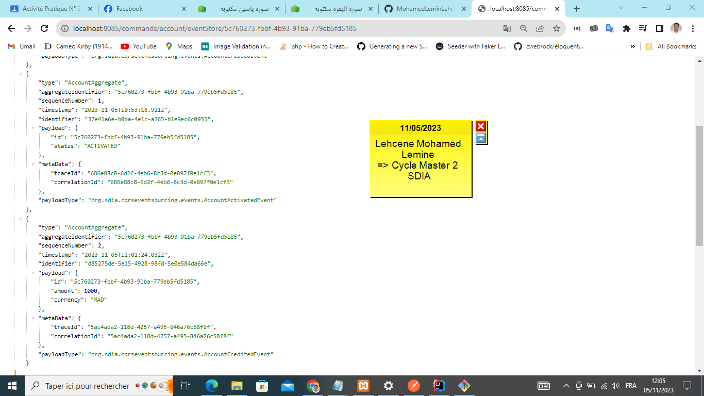

<li>On essye de faire l'opération Crédit sur un compte mais la valeur d'amount n'est pas suffisant</li>
 
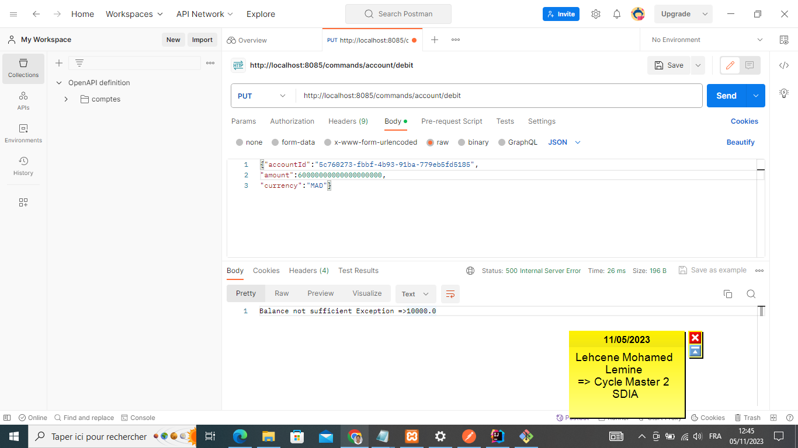

<li>On essye de faire l'opération Crédit sur un compte mais la valeur d'amount ne doit pas étre négative</li>

<li>Liste des comptes avec leur opérations</li>
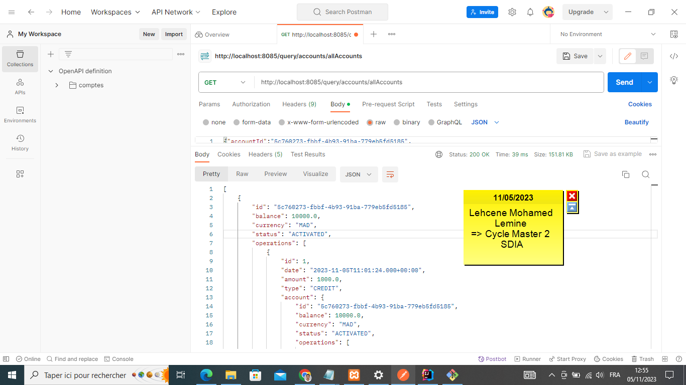

</ul>

