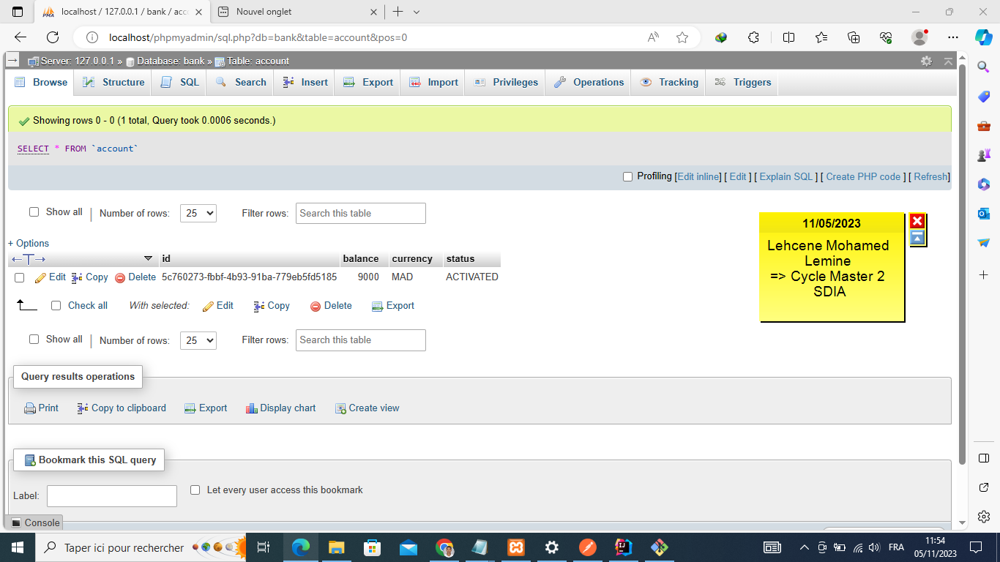

<h2>Compte rendu pour réaliser une application qui permet de gérer des comptes respectant les patterns CQRS et Event Sourcing avec les Framework AXON et Spring Boot :</h2>
<h3>Captures </h3>

<ul>
   
 

<li></li>

<li></li>

<li></li>

<li></li>

<li></li>

<li></li>

<li></li>

<li></li>

<li></li>

<li></li>

<li></li>

<li></li>

<li></li>

<li></li>

<li></li>

<li></li>

<li></li>

<li></li>

<li></li>

<li></li>

</ul>

